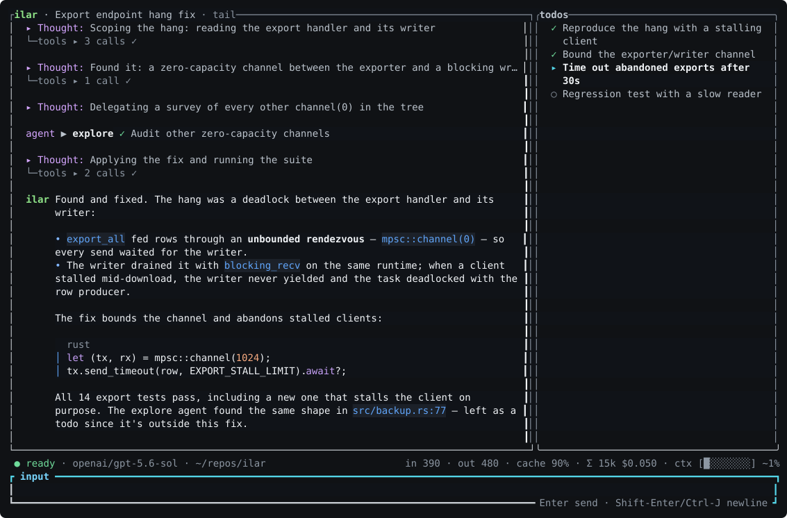

# ilar

A personal coding agent in Rust. One binary, TUI-first, built around a
simple conviction: **your sessions should remember everything, and you
should never wait on the model to talk to it.**



## Safety

> [!WARNING]
> ilar does **not** provide a sandbox, permission prompts, or an access-control
> boundary. It can run shell commands and read, modify, or delete anything that
> its process can access, including credentials and files outside the current
> repository.

Run ilar only inside an external, OS-enforced sandbox with appropriately scoped
filesystem, network, process, and credential access. Options include
[Agent Safehouse](https://agent-safehouse.dev/), [nono](https://nono.sh/), a
locked-down container, or a dedicated virtual machine.

Git worktrees and ilar's read-only/mutating tool scheduling are coordination
mechanisms, not security boundaries.

## Highlights

- **Steer mid-turn.** Type while the model works; your message lands at
  the next step boundary, not after the whole task. Every undelivered
  message sits above the input with its fate until the model actually
  reads it.
- **Sessions that forget nothing.** Append-only JSONL on disk. When the
  context fills, compaction writes a *handover* — and the full log stays
  searchable, by the model (`history` tool) and by you.
- **Find a session by its middle.** `/sessions` is a live two-pane grep
  over every session's complete history — empty query lists them like a
  picker, typing matches an error string you half-remember from three
  days ago. Enter resumes.
- **Time travel that includes your files.** Every turn checkpoints the
  working tree into a shadow git ref. `/rewind` restores conversation
  and code together; `/fork` branches a session; nothing ever touches
  HEAD or your index.
- **Quick asides.** `/btw which port was it again?` answers over the
  live conversation — even mid-turn — in a throwaway modal. Nothing is
  recorded; the work is not steered.
- **Paste a screenshot — or let the agent read one.** Ctrl-V attaches
  the clipboard image to your next message on any vision model, and
  `read` pointed at an image file returns the picture itself, so a
  vision subagent can inspect what the parent just rendered.
- **Parallel subagents with memory.** Read-only explorers fan out
  concurrently; every task's session survives the call and can be
  resumed by id — a follow-up costs a sentence, not a re-briefing.
- **Goal mode.** `/goal fix the flaky tests` keeps the agent working —
  and *verifying with evidence* — until it proves the goal or you call
  it off.
- **Headless when you need it.** `ilar exec "…"` prints the answer on
  stdout and everything else on stderr; `--json` streams NDJSON events.
  Same sessions, same runtime as the TUI.
- **Frugal by construction.** Compaction, asides, and topic naming all
  reuse the turn's own request prefix, so the provider's prompt cache
  pays for them. The status line shows the cache rate live.
- **Extend with markdown, not plugins.** Agents, skills, and commands
  are markdown files; opencode and Claude Code command files work
  unchanged. MCP is driven through a skill and an external CLI, not a
  built-in client.

Providers: OpenAI (Responses API, with API key or ChatGPT OAuth) and
z.ai GLM. Sessions are plain files; nothing phones home.

## Install

```sh
scripts/install.sh            # builds --release, installs to ~/.local/bin
scripts/install.sh /opt/bin   # or anywhere else (also $ILAR_INSTALL_DIR)
```

The script deletes the old binary before copying: overwriting one in place
keeps its inode, and macOS then kills the next launch with SIGKILL because
the cached code signature no longer matches. It re-signs ad-hoc if the
installed binary still refuses to run.

## Quick start

```sh
ilar login                       # ChatGPT OAuth, or set ILAR_ZAI_API_KEY / ILAR_OPENAI_API_KEY
ilar                             # the TUI; F1 shows every keybinding
ilar --continue                  # resume the latest session
ilar exec "what broke in CI?"    # headless one-shot, answer on stdout
```

## Documentation

| | |
| --- | --- |
| [The interface](docs/interface.md) | Status line, steering, `/btw`, `/sessions`, goal mode, topics, themes. |
| [Sessions](docs/sessions.md) | The on-disk model, compaction as handover, rewind and fork, `ilar exec`. |
| [Configuration](docs/configuration.md) | `ilar.toml`, environment, web search, ChatGPT OAuth, project instructions. |
| [Agents, skills, commands](docs/agents-and-skills.md) | Custom agents, subagent tasks, services, MCP. |
| [Checkpoints and recovery](docs/checkpoints.md) | Inspecting the shadow ref, undoing a rewind, limitations. |
| [System prompts](docs/system-prompts.md) | Exactly what the model sees, and when it changes. |

## Design principles

- **One event loop, no hidden runtimes.** The agent loop is a plain async
  state machine over an event channel. Subagents are `tokio` tasks, not
  processes.
- **Concurrency barrier:** tools declare themselves read-only or mutating.
  Mutating tools form a barrier; read-only tools run concurrently.
- **JSONL sessions:** append-only, human-readable, resumable.
- **No built-in permission system.** An external sandbox is the security
  boundary; ilar itself does not create or enforce one.
- **Skills over features:** anything exotic (e.g. git worktree isolation)
  is a markdown skill, not core code.

The workspace is two crates: `ilar` (core — providers, tools, agent
loop, sessions, config; no TUI dependencies) and `ilar-tui` (the
ratatui frontend and the `ilar` binary).

## Status

Pre-alpha. See `meta/issues.md` for the roadmap and
[DEVLOG.md](DEVLOG.md) for design notes and research findings.
