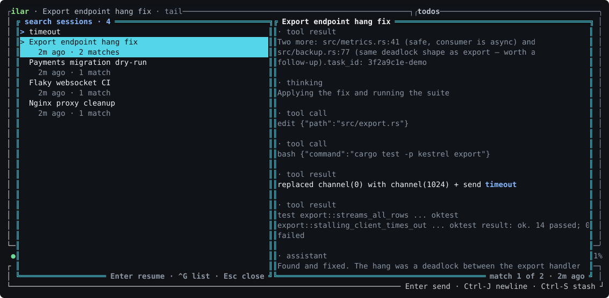

# The interface

Press **F1** any time for the full keybinding reference. This page
covers the parts that deserve more than a one-line hint.

## The status line

During a turn the status line reads like:

```
○ thinking · 84.2 KiB · 12.3 KiB/s   zai/glm-5.3   in 300 · out ~8.4k · cache 86% · Σ 1.2M $0.42 · ctx [██░░░░░░] 24%
```

- **Activity + liveness** — `thinking · 84.2 KiB · 12.3 KiB/s`: bytes
  streamed this turn and the current transfer rate. A silent stream shows
  `· no data Ns` after 3 seconds; `0 B · no data Ns` means the provider
  has not sent a single byte. The spinner alone proves nothing — only
  these numbers do.
- **`in` / `out`** — the last provider request's token usage. While a
  step streams, `out ~N` is a live estimate from streamed bytes
  (~4 bytes/token) and snaps to the exact reported value when the step
  completes.
- **`cache N%`** — how much of the last request's prompt the provider
  served from its cache, billed at the cheap cache-read rate. A healthy
  agentic session sits high and climbs as the conversation grows; a drop
  to 0% means the cached prefix was not matched (model switch, prompt
  change, or provider eviction) and that request's cost and latency just
  went up. `cache —` means the request had no prompt to speak of. The
  palette's "Session usage" entry still has the raw read/write counts.
- **`Σ tokens $cost`** — session-cumulative totals across all turns,
  priced per-step at each model's list rates (cache reads at the cache
  rate). Coding-plan models show `plan` instead of dollars; unknown
  models show tokens only. The palette's "Session usage" entry has the
  full breakdown.
- **`ctx …%`** — estimated context usage against the model's window
  (`~` marks estimates); compaction triggers at `compaction.threshold`.

## Steering and the queue

Type while a turn is running and the message **steers** it: the loop
delivers it at the next step boundary rather than after the whole task,
and a steer arriving as the model stops reopens the turn instead of
stranding the message. Until delivery, every pending message is listed
in a strip above the input with its fate — `steering · next step` or
`queued · when the turn ends` — and its row disappears the moment the
model actually receives it, which is also when the text appears in the
transcript. If a turn ends without delivering a steer — you aborted, or
it errored — the undelivered steers move to the queue rather than
vanishing. Turns with no steer channel (a notification routed from
another session) still queue as before.

Standing state — queued messages, the goal, background jobs, a retry
offer — is managed in the pending manager (**Ctrl-Q** or the palette):
delete one queued message, pull it back into the input for editing,
abort the goal or cancel background jobs (both confirmed with a second
press). **Esc is strictly immediate-scope**: it aborts the running turn
or clears the input, and never touches the queue or the goal.

## Asides: `/btw`

`/btw which port was it again?` answers a quick question over the live
conversation without becoming part of it: the model sees the whole
session, the answer opens in a scrollable modal, and neither the
question nor the answer is written to the log — an aside must never
steer the ongoing work. It runs beside a live turn (mid-turn is when
you want one), costs almost nothing thanks to the provider's prompt
cache, and a newer `/btw` replaces a still-running one.

## Switching sessions: `/sessions`



`/sessions` (or the palette's "Switch session", or just Ctrl-P → Enter)
opens a two-pane grep over every session you have:

- **Empty query**: your sessions newest-first — topic, age, and the
  last words said — with the tail of the conversation previewed on the
  right. A session picker, in other words.
- **Type anything**: rows become content matches from *every* session's
  full history, compacted-away material included; the preview shows
  each match in its surrounding conversation. Find a session by an
  error string you half-remember from its middle.
- **Enter** resumes the selected session at its tail. **`^G`** switches
  to the classic list picker, which is where title filtering, delete
  (`^D` twice) and fork (`^Y`) live.

## Session topics and the window title

After a session's first completed turn, ilar names it in a few words —
that topic appears in the transcript's title bar, the session listing,
the search, and your terminal's window title (`ilar — GM1 firmware
dig`) via the standard OSC escape. Sessions from before the feature
name themselves after their next completed turn.

## Goal mode

`/goal <description>` keeps ilar working until the goal is demonstrably
achieved: after every completed turn it auto-continues (in the same
session, so the prompt cache absorbs the cost) with an instruction to
verify progress using concrete evidence — running tests or a harness,
building one if none exists — and to keep working otherwise. The loop
ends when the model outputs an evidenced `GOAL_ACHIEVED:` line, when the
round cap (25) trips, or when you abort it explicitly (`/goal abort` or
the pending manager). `/goal` alone prefills the input for editing the
goal in place, keeping the round budget. Aborting a running turn pauses
the loop; it resumes after your next completed turn.

## The sidebar

On wide terminals the right column tracks session state: the todo list
the model maintains as it plans (**Ctrl-T** opens the full overlay),
running services, and — while subagents are in flight — an `agents`
panel with each task's description, agent, a `bg` marker for detached
work, and a live elapsed time.

## Transcript

The transcript renders markdown with syntax-highlighted code fences and
diffs for edits. **Ctrl-F** searches it, **Ctrl-O** opens any link it
contains, mouse drag selects and copies, and the palette's "Export
transcript" writes the session as a Markdown file. Tool rows expand on
click (or Enter targeting) to show arguments, diffs and output; grouped
tool calls align their columns to the widest sibling.

## Themes

`general.theme` or the **F3** picker. Authored: `carbon`, `parchment`,
`frost`, `high-contrast`, `terminal` (adapts to your terminal's own
palette). Ported: `monokai`, `dracula`, `gruvbox-dark`,
`gruvbox-light`, `solarized-dark`, `solarized-light`, `tokyo-night`,
`catppuccin-mocha`, `one-dark`, `rose-pine`.
